# Healthcare GraphRAG

**Patient Progress & Bottleneck Intelligence** — a graph-augmented retrieval
system that answers care-team questions over patient records and shows the exact
evidence behind every answer.

It builds a knowledge graph from clinical tables (patients, goals, barriers,
interventions, notes, incidents, medications…), retrieves the most relevant
document chunks for a question, and produces a grounded, structured answer with
an **answer-traceability graph** so reviewers can see *why* the system said what
it said.

> ⚠️ **All data is synthetic and for demonstration only. This is decision-support
> tooling, not medical advice.**

<p align="center">
  
</p>

---

## Highlights

- **Graph + retrieval, combined.** A NetworkX knowledge graph supplies
  structured relationships; a TF-IDF retriever supplies the relevant evidence
  text. Both feed the answer.
- **Answer traceability.** Every answer ships with the subgraph of evidence used
  to ground it, plus the retrieved chunks and their similarity scores.
- **Works with or without an LLM.** With a `GROQ_API_KEY`, answers are generated
  by a Groq-hosted model. Without one — or if the call fails — a deterministic
  extractive engine produces a grounded answer, so the demo never breaks.
- **Vercel-native.** A lean FastAPI serverless function plus a static
  single-page frontend. No database, no model server, fast cold starts.
- **Zero heavy runtime deps.** Data is loaded from a committed JSON snapshot and
  retrieval is pure-Python — pandas/scikit-learn are used only at build time.

---

## Architecture

The browser loads a static single-page app from the Vercel edge; `/api/*`
requests hit one FastAPI serverless function that runs the GraphRAG engine and
calls Groq, with a deterministic extractive fallback.

<p align="center">
  
</p>

### How a question is answered

A question fans out to TF-IDF retrieval and the knowledge graph in parallel;
their context is fused and sent to the model (or the extractive fallback) to
produce a grounded answer plus the evidence and traceability graph behind it.

<p align="center">
  
</p>

### Lean by design

Heavy data libraries (pandas, scikit-learn, numpy) run only at build time to
produce a committed JSON snapshot. The deployed function loads that snapshot with
the standard library and retrieves with a pure-Python index — so the serverless
bundle stays small and cold starts stay fast.

<p align="center">
  
</p>

See [ARCHITECTURE.md](ARCHITECTURE.md) for the full design rationale.

---

## Run locally

```bash
python -m venv .venv
# Windows: .venv\Scripts\activate   |   macOS/Linux: source .venv/bin/activate
pip install -r requirements-dev.txt

uvicorn graphrag.app:app --reload
# open http://127.0.0.1:8000
```

The committed `graphrag/dataset.json` means the app runs immediately. To
regenerate it from the source spreadsheets:

```bash
python scripts/prepare_data.py
```

### Enable generative answers (optional)

```bash
cp .env.example .env        # then set GROQ_API_KEY=...
```

Without a key the app runs on the extractive engine. With one, answers are
generated by a Groq-hosted model and the fallback only triggers on error.
The key is read from the environment only — never commit it (`.env` is
git-ignored).

---

## Deploy to Vercel

The project is configured for Vercel's Python runtime out of the box
([vercel.json](vercel.json)).

**Option A — CLI**

```bash
npm i -g vercel
vercel            # first deploy (preview)
vercel --prod     # production
```

**Option B — Dashboard**

1. Push this folder to a Git repository and **Import Project** on
   [vercel.com](https://vercel.com).
2. Framework preset: **Other** (no build step required).
3. Deploy.

**Configure the LLM** in *Project Settings → Environment Variables* (add the key
here only — never in the repo):

| Variable          | Required | Default                    | Purpose                            |
| ----------------- | -------- | -------------------------- | ---------------------------------- |
| `GROQ_API_KEY`    | for LLM  | —                          | Enables Groq-generated answers     |
| `LLM_MODEL`       | no       | `llama-3.3-70b-versatile`  | Override the Groq model            |
| `LLM_MAX_TOKENS`  | no       | `1024`                     | Max answer length                  |
| `LLM_TEMPERATURE` | no       | `0.1`                      | Sampling temperature               |
| `RETRIEVAL_TOP_K` | no       | `8`                        | Default chunks retrieved per query |

The static frontend is served by Vercel's CDN; `/api/*` is handled by the
serverless function. If `GROQ_API_KEY` is unset, the deployed demo still works —
it serves extractive answers.

---

## API

| Method | Path                  | Description                                        |
| ------ | --------------------- | ------------------------------------------------- |
| `GET`  | `/api/health`         | Liveness + whether an LLM is configured           |
| `GET`  | `/api/meta`           | Metrics, suggested questions, legend, table list  |
| `GET`  | `/api/patients`       | Patient roster                                    |
| `GET`  | `/api/graph`          | Patient knowledge graph (`?patient_id=P001\|all`) |
| `POST` | `/api/ask`            | Answer a question with evidence + reasoning graph |
| `GET`  | `/api/tables/{name}`  | Raw table rows                                    |

```bash
curl -X POST http://127.0.0.1:8000/api/ask \
  -H "Content-Type: application/json" \
  -d '{"question":"Which goals are at risk?","patient_id":"P001","top_k":6}'
```

Interactive docs are available at `/docs` when running locally.

---

## Testing

```bash
pip install -r requirements-dev.txt
pytest
```

---

## Project structure

```
api/index.py            Vercel serverless entry (exports the ASGI app)
graphrag/               GraphRAG engine
  ├─ app.py             FastAPI routes
  ├─ config.py          environment-driven settings
  ├─ dataset.py         JSON snapshot loader
  ├─ graph.py           knowledge-graph construction + traversal
  ├─ retrieval.py       pure-Python TF-IDF retriever
  ├─ reasoning.py       answer-traceability subgraph selection
  ├─ llm.py             Groq client + extractive fallback
  ├─ viz.py             vis-network serialization + node styling
  ├─ schemas.py         Pydantic request/response models
  └─ dataset.json       committed runtime data snapshot
public/                 static single-page frontend
scripts/prepare_data.py Excel → dataset.json (build-time only)
tests/                  pytest suite
data/                   source spreadsheets + data dictionary
```

---

## License

[MIT](LICENSE).
