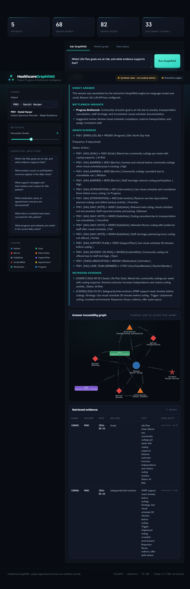

<div align="center">

# Healthcare GraphRAG

### Patient Progress &amp; Bottleneck Intelligence

**A graph-augmented retrieval system that answers care-team questions over patient
records — and shows the exact evidence behind every answer.**

[](https://healthcare-graphrag.vercel.app)

[](https://github.com/VikramKavuri/healthcare-graphrag/actions/workflows/ci.yml)
[](LICENSE)
[](pyproject.toml)
[](https://fastapi.tiangolo.com)
[](https://groq.com)
[](https://healthcare-graphrag.vercel.app)

[**Live demo**](https://healthcare-graphrag.vercel.app) · [Features](#-features) · [Architecture](#-architecture) · [Quickstart](#-quickstart) · [API](#-api) · [Deploy](#-deploy-your-own)


</div>

> [!WARNING]
> **All data is synthetic and for demonstration only. This is decision-support
> tooling, not medical advice.**

---

## ▸ Overview

Healthcare GraphRAG builds a **knowledge graph** from clinical tables (patients,
goals, barriers, interventions, notes, incidents, medications…), retrieves the
most relevant document chunks for a question, and produces a grounded, structured
answer with an **answer-traceability graph** so reviewers can see *why* the system
said what it said.

It runs as a single FastAPI serverless function plus a static single-page app —
no database and no model server — and degrades gracefully to a deterministic
extractive engine when no LLM is configured, so the demo never breaks.

<div align="center">
  <a href="https://healthcare-graphrag.vercel.app">
    
  </a>
  <br><em>A grounded answer, its traceability graph, and the retrieved evidence — live at
  <a href="https://healthcare-graphrag.vercel.app">healthcare-graphrag.vercel.app</a></em>
</div>

---

## Table of contents

- [Features](#-features)
- [Architecture](#-architecture)
- [Quickstart](#-quickstart)
- [Configuration](#-configuration)
- [API](#-api)
- [Deploy your own](#-deploy-your-own)
- [Testing](#-testing)
- [Project structure](#-project-structure)
- [Tech stack](#-tech-stack)
- [Contributing](#-contributing)
- [License](#-license)

---

## ✦ Features

| | |
| --- | --- |
| **Graph + retrieval, combined** | A NetworkX knowledge graph supplies structured relationships; a TF-IDF retriever supplies the relevant evidence text. Both feed the answer. |
| **Answer traceability** | Every answer ships with the subgraph of evidence used to ground it, plus the retrieved chunks and their similarity scores. |
| **Works with or without an LLM** | With a `GROQ_API_KEY`, answers are generated by a Groq-hosted model. Without one — or on error — a deterministic extractive engine produces a grounded answer. |
| **Vercel-native** | A lean FastAPI serverless function + a static single-page frontend. No database, no model server, fast cold starts. |
| **Lean runtime** | Data loads from a committed JSON snapshot and retrieval is pure-Python — pandas / scikit-learn run only at build time. |
| **Tested & typed** | Pydantic-typed API, a pytest suite covering the engine and every endpoint, and CI on every push. |

---

## ⛯ Architecture

The browser loads a static single-page app from the Vercel edge; `/api/*` requests
hit one FastAPI serverless function that runs the GraphRAG engine and calls Groq,
with a deterministic extractive fallback.

<div align="center">
  
</div>

### How a question is answered

A question fans out to TF-IDF retrieval and the knowledge graph in parallel; their
context is fused and sent to the model (or the extractive fallback) to produce a
grounded answer plus the evidence and traceability graph behind it.

<div align="center">
  
</div>

### Lean by design

Heavy data libraries (pandas, scikit-learn, numpy) run only at build time to
produce a committed JSON snapshot. The deployed function loads that snapshot with
the standard library and retrieves with a pure-Python index — so the serverless
bundle stays small and cold starts stay fast.

<div align="center">
  
</div>

> See **[ARCHITECTURE.md](ARCHITECTURE.md)** for the full design rationale and component breakdown.

---

## ⚡ Quickstart

**Requirements:** Python 3.10+

```bash
# 1. Clone
git clone https://github.com/VikramKavuri/healthcare-graphrag.git
cd healthcare-graphrag

# 2. Install
python -m venv .venv
# Windows: .venv\Scripts\activate   |   macOS/Linux: source .venv/bin/activate
pip install -r requirements-dev.txt

# 3. Run
uvicorn graphrag.app:app --reload
# open http://127.0.0.1:8000   ·   interactive API docs at /docs
```

The committed `graphrag/dataset.json` means the app runs immediately. To
regenerate it from the source spreadsheets:

```bash
python scripts/prepare_data.py
```

### Enable generative answers (optional)

```bash
cp .env.example .env        # then set GROQ_API_KEY=...
```

Without a key the app runs on the extractive engine. With one, answers are
generated by a Groq-hosted model and the fallback only triggers on error. The key
is read from the environment only — never commit it (`.env` is git-ignored).

---

## ⚙ Configuration

All settings are environment variables with safe defaults. Set them in a local
`.env` file or, in production, in your Vercel project's environment variables.

| Variable          | Required | Default                   | Purpose                              |
| ----------------- | -------- | ------------------------- | ------------------------------------ |
| `GROQ_API_KEY`    | for LLM  | —                         | Enables Groq-generated answers       |
| `LLM_MODEL`       | no       | `llama-3.3-70b-versatile` | Override the Groq model              |
| `LLM_MAX_TOKENS`  | no       | `1024`                    | Max answer length                    |
| `LLM_TEMPERATURE` | no       | `0.1`                     | Sampling temperature                 |
| `RETRIEVAL_TOP_K` | no       | `8`                       | Default chunks retrieved per query   |

---

## ⇄ API

| Method | Path                  | Description                                        |
| ------ | --------------------- | ------------------------------------------------- |
| `GET`  | `/api/health`         | Liveness + whether an LLM is configured           |
| `GET`  | `/api/meta`           | Metrics, suggested questions, legend, table list  |
| `GET`  | `/api/patients`       | Patient roster                                    |
| `GET`  | `/api/graph`          | Patient knowledge graph (`?patient_id=P001\|all`) |
| `POST` | `/api/ask`            | Answer a question with evidence + reasoning graph |
| `GET`  | `/api/tables/{name}`  | Raw table rows                                    |

```bash
curl -X POST https://healthcare-graphrag.vercel.app/api/ask \
  -H "Content-Type: application/json" \
  -d '{"question":"Which goals are at risk?","patient_id":"P001","top_k":6}'
```

Interactive OpenAPI docs are available at `/docs`.

---

## ▲ Deploy your own

[](https://vercel.com/new/clone?repository-url=https%3A%2F%2Fgithub.com%2FVikramKavuri%2Fhealthcare-graphrag)

The project is configured for Vercel's Python runtime out of the box
([vercel.json](vercel.json)) — a `@vercel/python` function for the API and static
hosting for the frontend.

```bash
npm i -g vercel
vercel --prod
```

Then (optional) add `GROQ_API_KEY` in **Project Settings → Environment Variables**
to upgrade from extractive answers to LLM-generated answers. If it's unset, the
deployed demo still works — it serves extractive answers.

---

## ✓ Testing

```bash
pip install -r requirements-dev.txt
pytest
```

The suite covers the dataset loader, graph construction, retrieval ranking,
reasoning subgraphs, the extractive/LLM answer paths, and every API endpoint. CI
runs it on every push and pull request.

---

## ▦ Project structure

```text
api/index.py            Vercel serverless entry (exports the ASGI app)
graphrag/               GraphRAG engine
├─ app.py               FastAPI routes
├─ config.py            environment-driven settings
├─ dataset.py           JSON snapshot loader
├─ graph.py             knowledge-graph construction + traversal
├─ retrieval.py         pure-Python TF-IDF retriever
├─ reasoning.py         answer-traceability subgraph selection
├─ llm.py               Groq client + extractive fallback
├─ viz.py               vis-network serialization + node styling
├─ schemas.py           Pydantic request/response models
└─ dataset.json         committed runtime data snapshot
public/                 static single-page frontend
assets/                 animated architecture diagrams (SVG)
scripts/prepare_data.py Excel → dataset.json (build-time only)
tests/                  pytest suite
data/                   source spreadsheets + data dictionary
```

---

## ❖ Tech stack

**Backend** — Python · FastAPI · NetworkX · pure-Python TF-IDF · Groq SDK
**Frontend** — vanilla JS · [vis-network](https://visjs.github.io/vis-network/) · zero build step
**Infra** — Vercel (serverless Python + static CDN)
**Quality** — Pydantic · pytest · Ruff · GitHub Actions CI

---

## ⤳ Contributing

Contributions are welcome — see **[CONTRIBUTING.md](CONTRIBUTING.md)** for the
development workflow, coding standards, and how to run the checks.

---

## ⚖ License

Released under the [MIT License](LICENSE).

---

<div align="center">
  <sub>Synthetic data only · decision-support tooling, not medical advice · built by
  <a href="https://github.com/VikramKavuri">VikramKavuri</a></sub>
</div>
